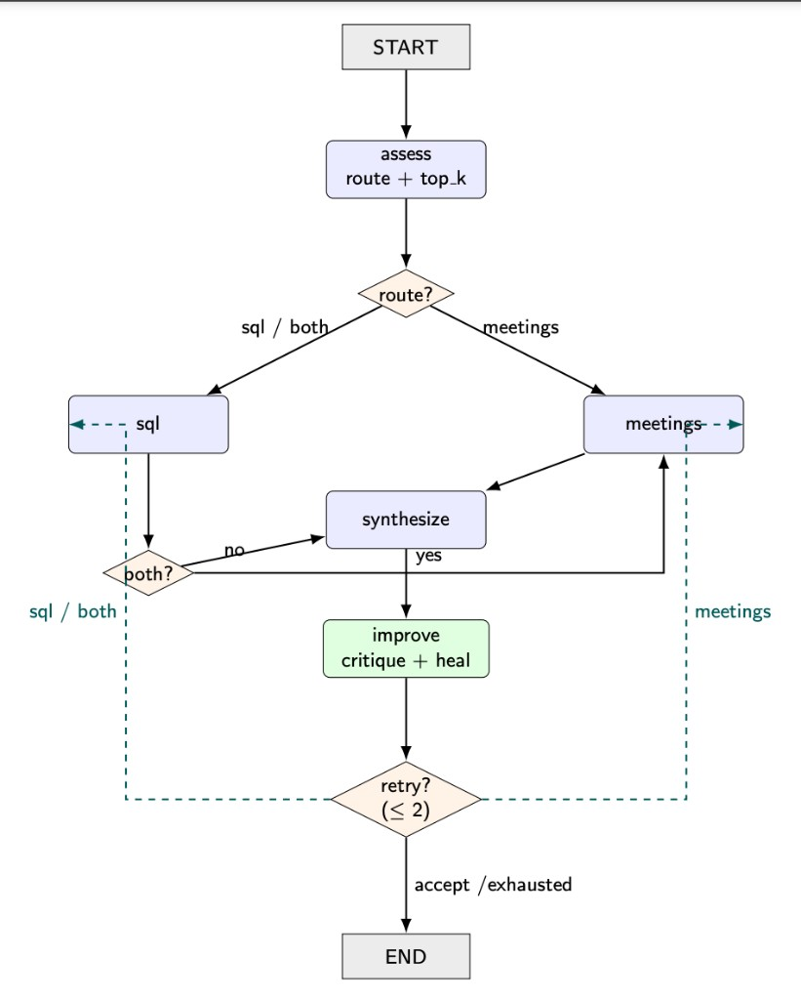

# Investment Data Chatbot

Custom hybrid RAG chatbot for natural-language questions over investment, meeting, and performance data — centered on **Client**, **Group**, **Deal**, and **RM**.

Built as a system-design / data-handling exercise for an AI Engineer role —
hybrid retrieval + LangGraph orchestration (not a thin framework wrapper).

## Architecture

Orchestration is a **LangGraph** `StateGraph` (`src/graph.py`) so routing, tool
selection, and synthesis are explicit nodes with conditional edges — easy to
extend (retries, extra sources, human-in-the-loop) without rewriting a script.

```
Question
   │
   ▼
┌──────────────────────────────────────────────────────────────┐
│  LangGraph agent (self-healing RAG)                          │
│                                                              │
│  [assess] ──► sql | meetings | both (+ top_k)                │
│     │                                                        │
│     ├─ [sql]        text-to-SQL → guardrails → RO Postgres   │
│     ├─ [meetings]   embed → pgvector (meeting_notes)         │
│     ├─ [synthesize] grounded answer from evidence            │
│     └─ [improve]    critique → accept | retry (≤ 2×)         │
│                      └─ heal route / top_k / query / feedback│
└──────────────────────────────────────────────────────────────┘
```



| Sheet | Rows | Path |
|---|---|---|
| `Investments_data_50k` | 50,000 | Text-to-SQL |
| `performance_data` | 1,632 | Text-to-SQL |
| `meeting_notes_20k` | 20,000 | Embeddings + pgvector |

## Setup

1. Python 3.11+ recommended. Create a venv and install deps:

```bash
python3 -m venv .venv
source .venv/bin/activate
pip install -r requirements.txt
```

2. Copy `.env.example` → `.env` and fill:
   - `DATABASE_URL` — Supabase **Session pooler** URI (write; ETL)
   - `DATABASE_URL_READONLY` — same for now, or a SELECT-only role
   - `OPENAI_API_KEY`

3. Load structured data, then meeting notes + embeddings:

```bash
python -m etl.load_structured
python -m etl.load_meetings          # ~$0.16 with text-embedding-3-small; several minutes
```

4. Run the UI:

```bash
streamlit run app.py
```

## Key design decisions

1. **LangGraph orchestration + self-healing RAG**  
   Nodes: `assess` → `sql` / `meetings` → `synthesize` → `improve`, with
   conditional edges for `sql` | `meetings` | `both`. The improve node critiques
   evidence/answer and can replan (route, `top_k`, client filter, retrieval query,
   SQL feedback) for up to **2 retries**. Shared typed state; UI step callbacks
   via `configurable`.

2. **Hybrid retrieval, not one tool for everything**  
   Structured metrics are exact with SQL; free-text meeting notes need semantic search. An assessor chooses route + retrieval depth (`top_k`) per question.

3. **Text-to-SQL with layered guardrails**  
   - `sqlglot` parse → single `SELECT` / `WITH…SELECT` only  
   - Forbidden keyword regex (INSERT/UPDATE/DELETE/DDL…)  
   - Whitelist tables: `investments`, `performance`  
   - Auto `LIMIT` (default 100, max 500)  
   - Execute only via `DATABASE_URL_READONLY` with `default_transaction_read_only=on` and `statement_timeout=15s`

4. **Embeddings: `text-embedding-3-small` (1536-d) + HNSW**  
   Cheap (~$0.16 one-time for 20k notes), strong enough for this corpus. HNSW index for low-latency cosine search.

5. **Cheap chat model: `gpt-4o-mini`**  
   Used for routing, SQL generation, and synthesis to keep demo cost low.

6. **Normalized snake_case Postgres schema**  
   Excel column names are messy; ETL maps them once so the SQL prompt stays stable.

7. **Synthesis is a separate LLM call**  
   Keeps tool outputs inspectable (debug panel) and answers grounded in evidence JSON.

## Deliberate simplifications (note for reviewers)

| Simplification | Why | Production next step |
|---|---|---|
| `DATABASE_URL_READONLY` may equal write URL | Supabase role setup skipped for speed | Create `chatbot_readonly` with `SELECT` only; point RO URL at it |
| No auth / multi-tenancy in Streamlit | Demo UI | Add auth + row-level security by RM/client |
| Router is a single LLM classify call | Simple & transparent | Add deterministic heuristics (keyword → meetings) + confidence |
| No query caching / conversation memory beyond Streamlit session | Scope | LangGraph checkpoints + thread_id; cache embeddings & SQL |
| Meeting filter by `client_id` only when router extracts it | Avoid over-filtering | Better entity linking (deal/RM/company) |
| MOIC kept as text (`'2.3x'`) | Matches source data | Parse to numeric in ETL for better aggregates |
| No eval harness | Time | Golden question set + faithfulness checks |
| API key / secrets in `.env` only | Local demo | Secrets manager; **rotate any key pasted in chat** |

## Project layout

```
app.py                      # Streamlit UI
etl/load_structured.py      # Excel → investments + performance
etl/load_meetings.py        # Excel → meeting_notes + embeddings
sql/schema_structured.sql
sql/schema_meetings.sql
src/
  config.py                 # env loading
  db.py                     # RW / RO connections
  llm.py                    # OpenAI helpers
  sql_guardrails.py         # SELECT-only validation
  text_to_sql.py            # generate + execute SQL
  retrieve.py               # pgvector search
  assess.py                 # brain: sql | meetings | both + top_k chunks
  router.py                 # thin alias → assess (compat)
  synthesize.py             # final answer
  improve.py                # critique + self-heal plan (≤ 2 retries)
  graph.py                  # ★ full pipeline map (nodes, edges, ASCII diagram)
  chat.py                   # public ask() → invokes graph
```

## Example questions

- “What is the total USD invested by client A12345?”
- “Which RM has the highest total investment amount?”
- “What diligence concerns came up for fintech deals in EMEA?”
- “How is client A12345 performing on IRR, and what was discussed in recent meetings?”

## Future improvements

- **Finance-specific embeddings** — swap general `text-embedding-3-small` for a domain model trained on investment / research text so meeting retrieval ranks diligence language more accurately.
- **Stronger generation model** — use a higher-capability model for synthesis (and optionally SQL) while keeping a cheaper model for light steps.
- **Better assessor** — improve route / `top_k` / entity extraction with a stronger or fine-tuned classifier so sql vs meetings vs both is less wrong on edge cases.
- **Planning layer over assess** — add an explicit planner above the assessor that decomposes multi-part questions into ordered tool steps before retrieval runs.
- **Hybrid RAG** — combine keyword (BM25 / Postgres FTS) with semantic vector search so exact tickers, client IDs, and deal names are not missed by embeddings alone.
- **Reranker** — cross-encoder (or LLM) rerank of meeting chunks after hybrid retrieval to keep only the most answer-relevant evidence.
- **Model routing by query type** — pick models per step/query (e.g. small for assess, domain embedder for meetings, stronger model for hard SQL / synthesis) instead of one model for everything.
